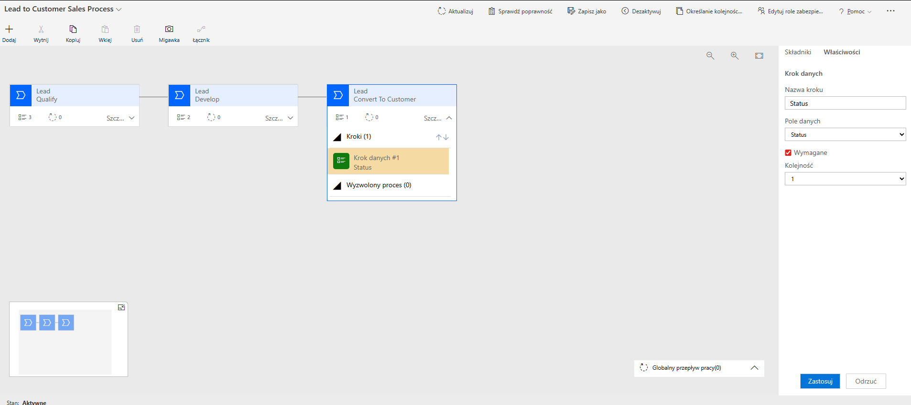

Lead → Customer Conversion (Dynamics 365 / Dataverse)
📌 Overview

The goal of this solution was to design a standardized process for converting leads into customers within Microsoft Dynamics 365 (Dataverse), using:

Business Process Flow (BPF) – to guide users through the sales process
Power Automate – to handle automation and business logic
Custom table (dev_lead) – as the source of lead data

This approach eliminates the need for manual actions (e.g., custom buttons) and ensures a consistent, auditable business process.

🧱 Solution Architecture

The solution follows a clear separation of responsibilities:

Business Process Flow (BPF) – process control and user guidance
Dataverse (dev_lead) – data storage
Power Automate – automation and record creation

🔁 Flow:
User works on a dev_lead record
Progresses through defined BPF stages
Marks the record as ready (ready_to_convert)
Power Automate automatically:
creates a Customer
maps data from the lead
updates the source record
