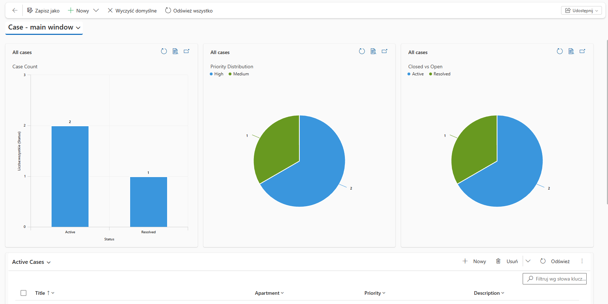

# 📊 CRM Dashboard Setup (Stage 1)

As part of the Customer Service Workflow project built on **Microsoft Dynamics 365**, a custom **Service Dashboard** was created to visualize case data in real time.

---

## 🎯 Purpose

The dashboard provides a quick overview of customer service operations, allowing users to monitor key metrics without navigating through individual records.

---

## 🧩 What was implemented

- Created a **custom system dashboard** in Dynamics 365
- Added the dashboard to a custom application navigation (Sitemap)
- Configured charts based on the **Case (Incident)** entity
- Published the solution to make the dashboard available in the app

---

## 📊 Dashboard Content

The dashboard includes the following key metrics:

- 📌 Total number of cases
- 🔥 High priority cases
- ✅ Closed vs Open cases

Visualized using standard Dynamics 365 charts:

- Bar charts
- Pie/Status charts (where applicable)

---

## ⚙️ Technical Notes

- Dashboard is part of a **Solution-based deployment**
- Charts and views must be included in the same solution to avoid runtime errors
- Dashboard is accessible from the Customer Service application navigation

---

## 🚀 Result

The system now provides a centralized view of customer service performance, enabling quick insights into case volume, priority distribution, and resolution status.
