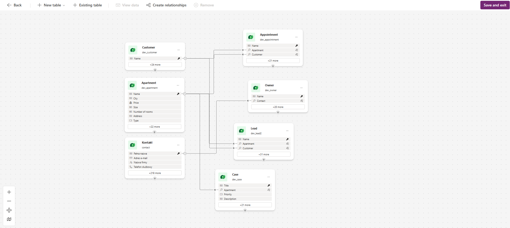

# 🏢 Real Estate Customer Service Solution

## 📌 Overview

This project is a **low-code CRM solution** built using Microsoft Power Platform.  
It is designed to manage real estate operations, including apartment listings, customer interactions, sales leads, and customer service requests.

The solution integrates:

- Power Apps (Canvas App)
- Dynamics 365 (Customer Service)
- Power Automate
- Microsoft Dataverse

---

## 🧠 Architecture

The system follows a **three-layer architecture**:

### 1. Data Layer

All data is stored in **Microsoft Dataverse**, which serves as the central database.

### Core Tables:

- **Apartments**
- **Customers**
- **Leads**
- **Cases**
- **Appointments**
- **Owners**
- **Contact**

---

### 2. Application Layer

A **Canvas App** built in Power Apps provides the user interface.

#### Main Features:

- Dashboard with key metrics
- Apartment management (list, filter, details)
- Lead tracking and status management
- Customer service case handling

---

### 3. Automation Layer

Business processes are automated using Power Automate.

#### Example Flows:

- New lead → email notification
- Appointment scheduled → reminder notification
- Case created → automatic assignment
- Case resolved → customer notification

---

## 🔗 Data Model

The system uses **one-to-many relationships**:

- One Customer → Many Leads
- One Customer → Many Cases
- One Customer → Many Appointments
- One Apartment → Many Leads
- One Apartment → Many Cases
- One Apartment → Many Appointments
- One Owner → Many Apartments

Relationships are implemented using **lookup columns** in Dataverse.

---

## 📊 Dashboard

The application includes a dashboard displaying:

- Total Apartments
- Active Leads
- Open Cases

---

## 🔐 Security

Role-based access control:

- **Agent** – manages leads and cases
- **Manager** – full visibility
- **Admin** – system configuration

---

## 🚀 Key Features

- Centralized data management with Dataverse
- Real-time insights via dashboard
- Automated workflows
- Scalable and modular architecture
- Integration with Dynamics 365

---

## 🛠️ Technologies Used

- Microsoft Power Apps
- Microsoft Dataverse
- Dynamics 365
- Power Automate

---

## 👨‍💻 Author

Created as a learning project to demonstrate practical skills in Power Platform and Dynamics 365.
