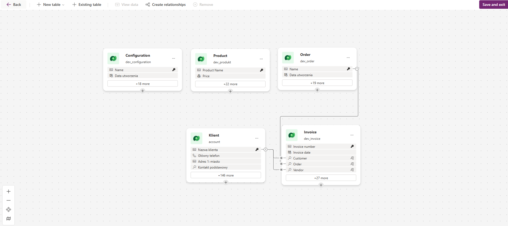
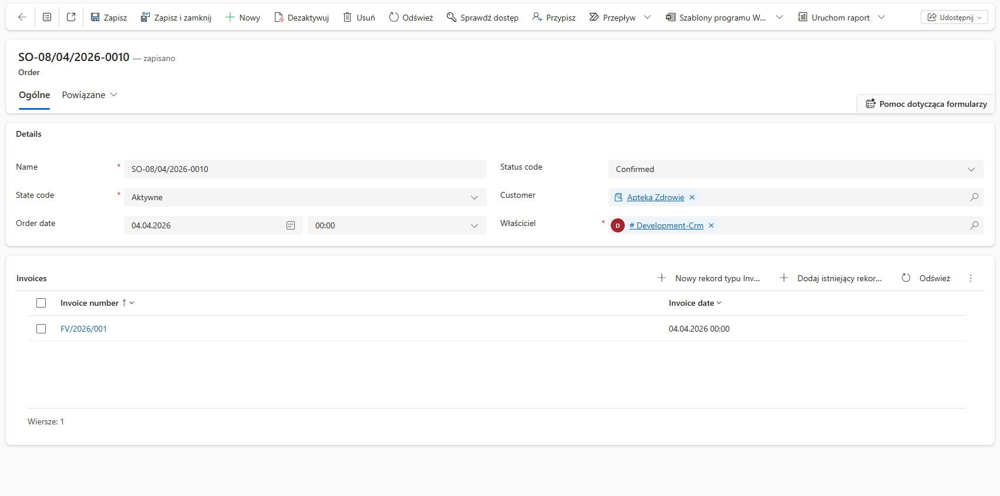
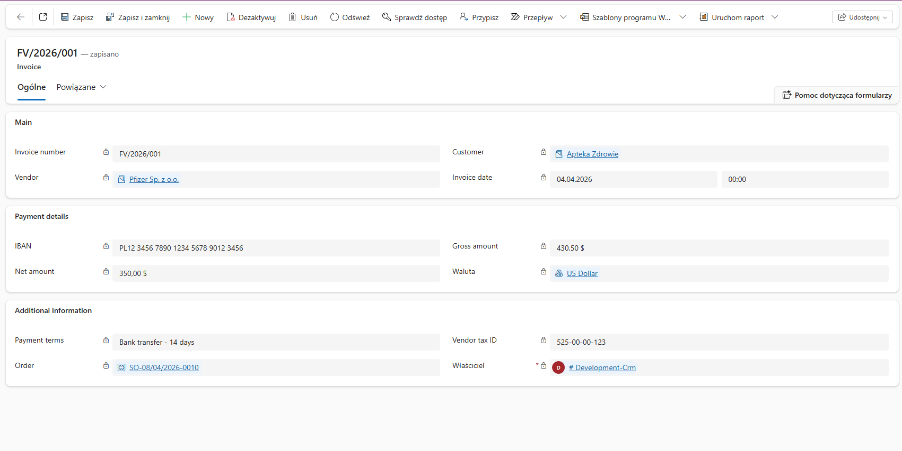
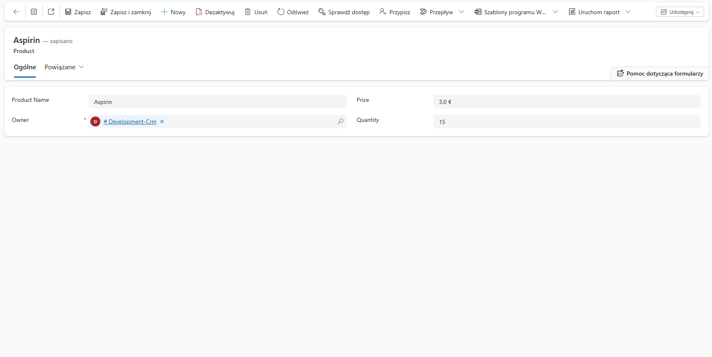

🗄️ Database Schema Overview

This project uses a structured set of tables to manage products, customers, orders, and billing.

⚙️ Configuration

Stores global application settings and configuration values used across the system.

📦 Product

Contains product information, including names, pricing, and additional attributes required for catalog management.

🧾 Order

Represents customer orders with core details and creation metadata. Acts as a central entity in the sales flow.

👤 Client (Account)

Maintains customer data such as name, contact information, and address details.

💰 Invoice

Handles billing records, linking customers and orders together. Includes invoice numbers, dates, and related references.

🔗 Relationships
An Order can be associated with an Invoice
An Invoice is linked to a Client
A Client can have multiple Invoices
Products are referenced within the ordering process

