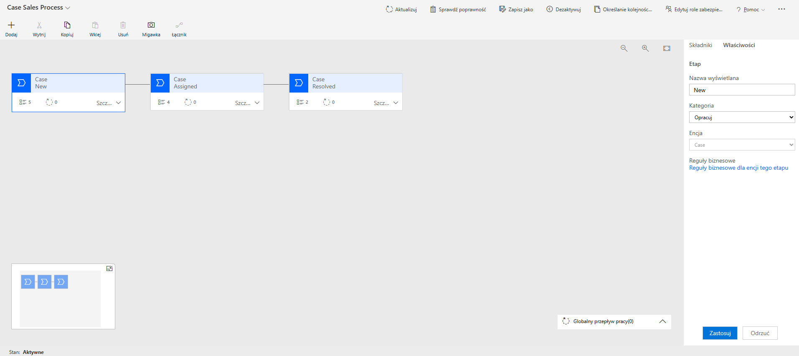

New Case – The initial stage where key information like title, account, and priority must be entered before progressing. Optional details such as origin and description can also be added.

Assigned – This stage ensures the case is properly allocated and categorized. A required agent must be assigned, and the case type must be defined before moving forward.

Resolved – The final stage where the case is completed. The resolution date is required, while resolution time can be automatically calculated.

A transition condition (status = New) is applied between the first and second stages to prevent users from bypassing the assignment step, ensuring the process is followed correctly.

Overall, this BPF improves data quality, enforces business rules, and standardizes how cases are handled within the system.
