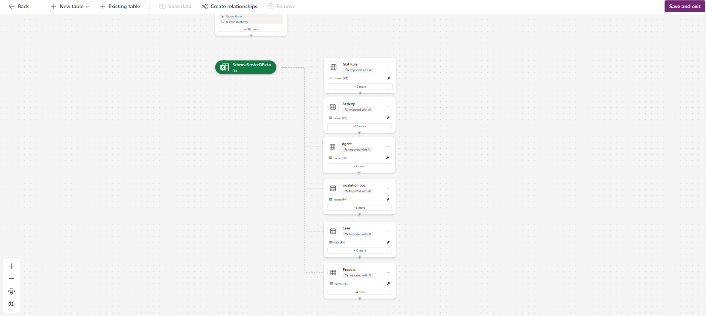
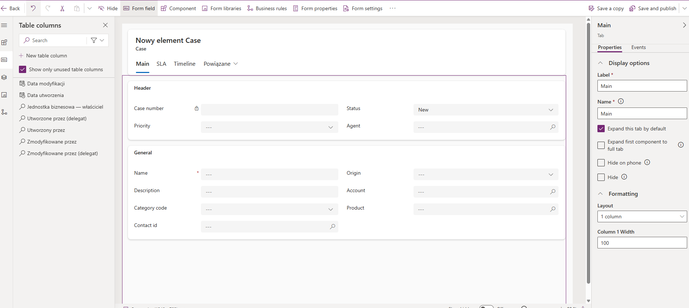
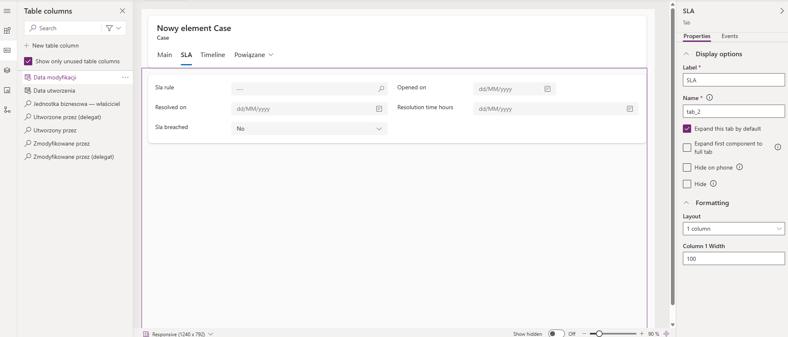
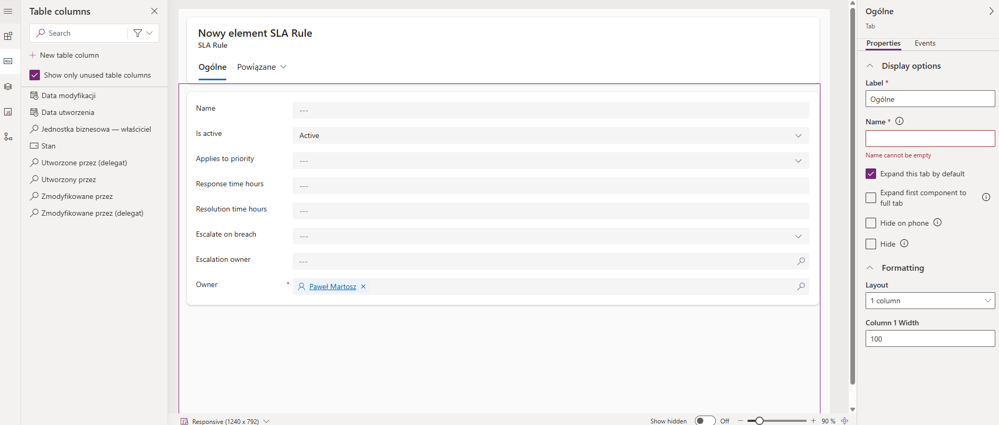
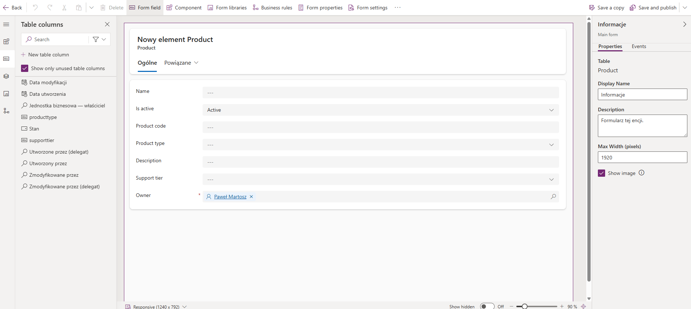
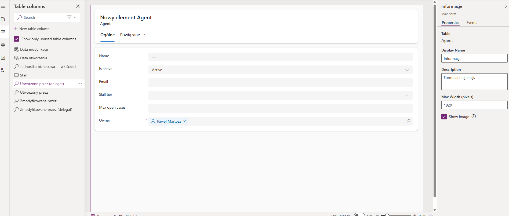
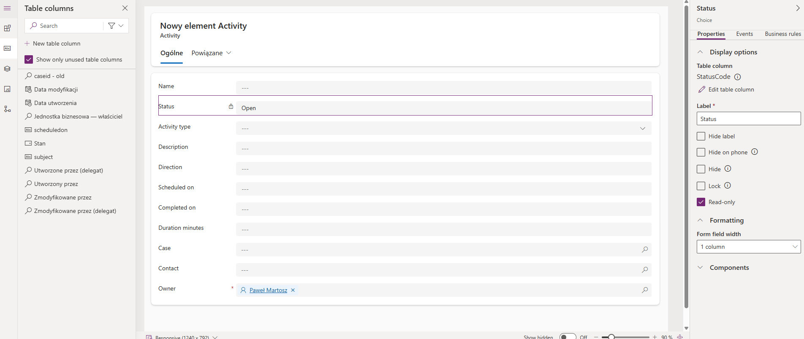
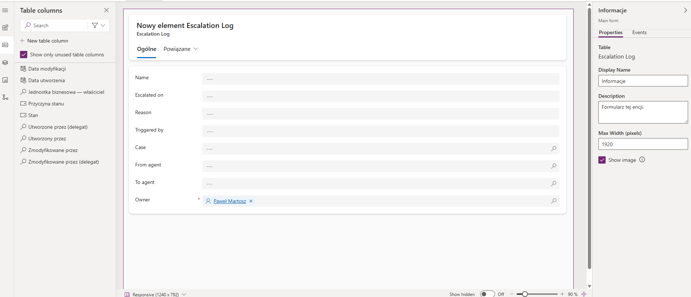

Tables:

Relatioship:
• sdp_case Many-to-One sdp_account (account_id)
• sdp_case Many-to-One sdp_contact (contact_id)
• sdp_case Many-to-One sdp_product (product_id)
• sdp_case Many-to-One sdp_sla_rule (sla_rule_id)
• sdp_case Many-to-One sdp_agent (assigned_agent_id)
• sdp_activity Many-to-One sdp_case (case_id)
• sdp_escalation_log Many-to-One sdp_case (case_id)

Cases:

SLA Rule:

Product:

Agent:

Activity:

Escalation log:

