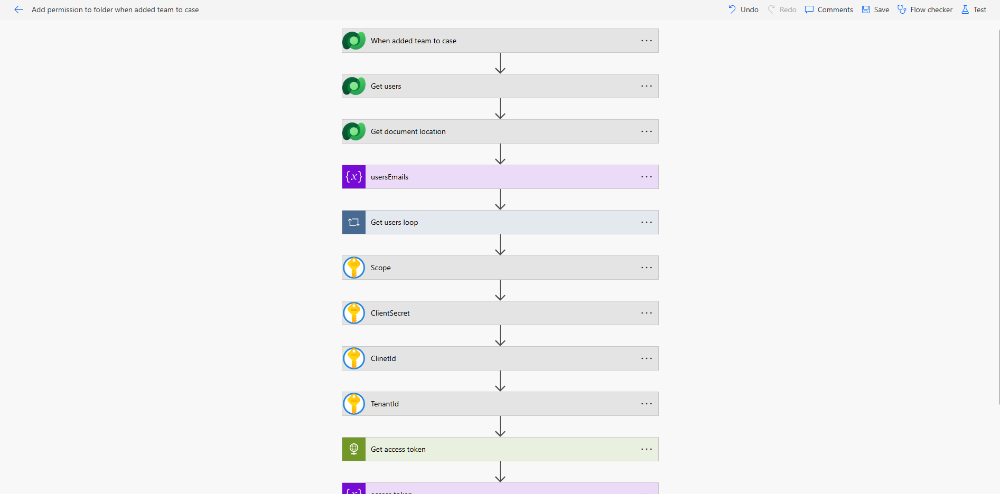
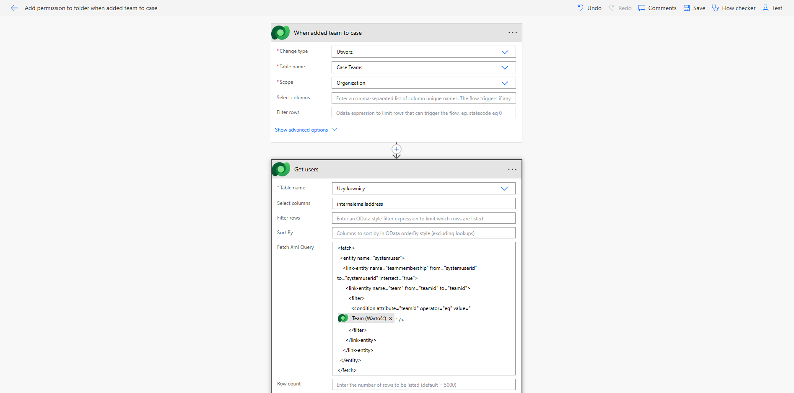
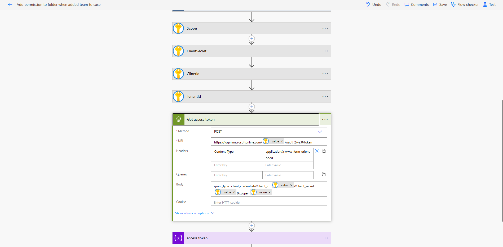
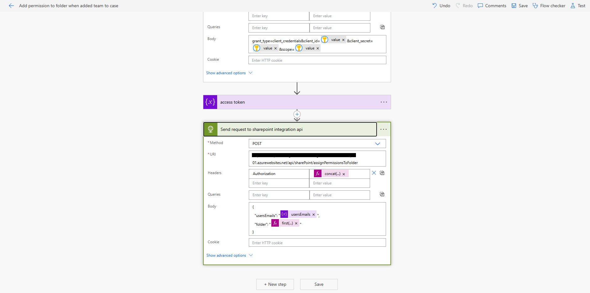

📁 Auto SharePoint Permissions for Case Teams

Overview
This Power Automate flow automatically grants SharePoint folder permissions to all members of a Case Team when a new team is created in Dynamics 365 CRM. It eliminates the need for manual permission management by connecting CRM team membership directly to SharePoint document locations via a secure integration API.

⚡ Trigger
EventDetailsWhenA new Case Team is created in Dynamics 365TypeDataverse — When a row is addedTableTeams (teams)

🔄 Flow Steps

1. 👥 Get Team Members
   Queries the Team Membership relationship (teammembership) using a FetchXML request to retrieve all users assigned to the newly created Case Team.
2. 📂 Get Document Location
   Fetches the SharePoint Document Location record linked to the related Case (incident) from Dataverse — sharepointdocumentlocations table — filtered by the case ID.
   This location represents the SharePoint folder automatically generated by Dynamics 365 native document management.
3. 📧 Build User Emails Array
   Iterates over team members using an Apply to each loop and appends each user's email address into a usersEmails string array variable.
4. 🔐 Retrieve Secrets from Azure Key Vault
   Securely fetches credentials (Client ID, Client Secret, Tenant ID) from Azure Key Vault to avoid hardcoded secrets in the flow.
5. 🪙 Obtain OAuth 2.0 Access Token
   Requests an access token from Microsoft Identity Platform using the Client Credentials grant flow, authenticating the integration service account.
   POST https://login.microsoftonline.com/{tenant_id}/oauth2/v2.0/token
   grant_type: client_credentials
6. 📨 Call SharePoint Integration API
   Sends an authenticated HTTP POST request to the SharePoint Integration API with the following payload:
   json{
   "usersEmails": ["user1@company.com", "user2@company.com"],
   "folder": "incidents/case-001-folder"
   }
   The API grants the specified users access permissions to the SharePoint folder associated with the Case.

🏗️ Architecture
Dynamics 365 (Case Team Created)
│
▼
Get Team Members (FetchXML)
│
▼
Get SharePoint Document Location
│
▼
Build usersEmails Array (Loop)
│
▼
Azure Key Vault (Fetch Secrets)
│
▼
OAuth 2.0 — Get Access Token
│
▼
SharePoint Integration API
POST /permissions
{ usersEmails, folder }
│
▼
✅ Users granted access to Case folder

🔑 Key Expressions Used
PurposeExpressionGet team member emailitems('Apply_to_each')?['emailaddress1']Get case folder pathfirst(outputs('Get_document_location')?['body/value'])?['relativeurl']Filter document location_regardingobjectid_value eq items('Apply_to_each')?['incidentid']

🔒 Security

Credentials are never hardcoded — all secrets are stored in Azure Key Vault
API authentication uses OAuth 2.0 Client Credentials flow (service-to-service)
The flow runs under a dedicated service account with least-privilege access

📋 Prerequisites
RequirementDetailsDynamics 365Case management with native SharePoint integration enabledSharePointDocument management configured in D365Azure Key VaultClient ID, Secret, and Tenant ID stored as secretsSharePoint Integration APIDeployed and accessible endpoint for permission managementPower AutomatePremium connectors: Dataverse, HTTP, Azure Key Vault

📌 Notes

The SharePoint folder is created automatically by Dynamics 365 native document logic upon Case creation.
This flow is designed to run asynchronously — it does not block Case Team creation.
If a user is already granted access, the Integration API should handle idempotency gracefully.
