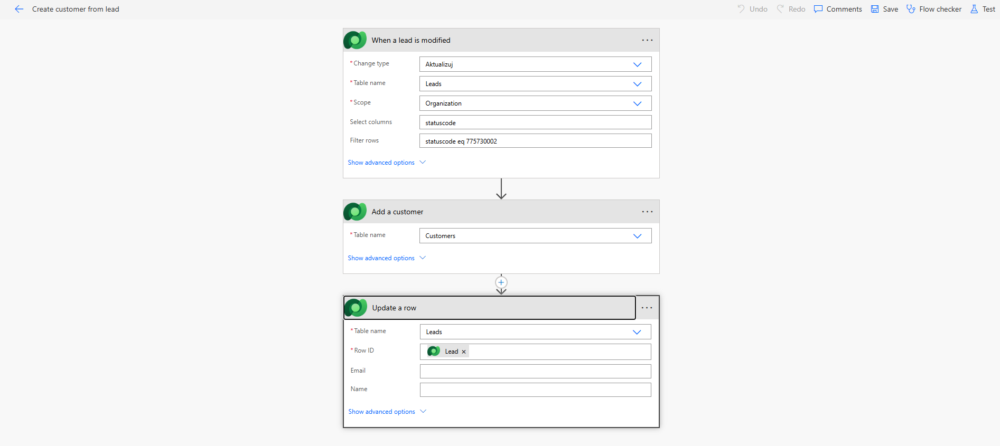

## ⚙️ Power Automate – Lead to Customer Conversion

The Power Automate flow is responsible for converting a lead (`dev_lead`) into customer records within Dataverse.

### 🔹 Trigger

The flow is triggered when a `dev_lead` record is updated and meets the following condition:

- status code equal `ready_to_convert`

---

### 🔹 Core Logic

Once triggered, the flow performs the following actions:

1. **Create Contact**
   - A new Contact record is created using personal data from the lead

2. **Map Data from Lead**
   Key fields are transferred from `dev_lead` to the new records:

   | Lead (`dev_lead`) | Customer   |
   | ----------------- | ---------- |
   | Company Name      | —          |
   | Email             | Email      |
   | Phone             | Phone      |
   | First Name        | First Name |
   | Last Name         | Last Name  |
   | Budget            | Budget     |
   | City              | City       |

3. **Update Source Record**
   - The `dev_lead` record is updated with references to:
     - created Customer

---

### 🔹 Outcome

The flow ensures that:

- customer data is consistently created from lead data
- relationships between records are properly established
- manual data entry is minimized

---

### 🔹 Notes

- The flow should include duplicate checks (e.g., existing Contact by name or email domain)
- Error handling and retry logic are recommended for production scenarios
- Additional fields can be mapped depending on business requirements

---
