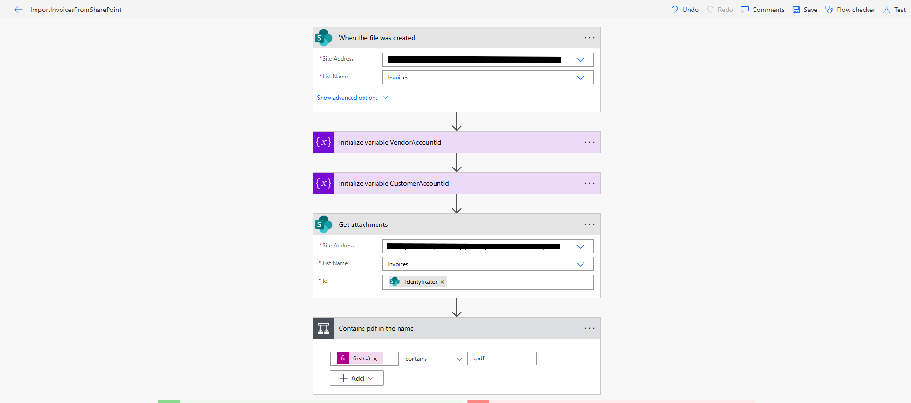
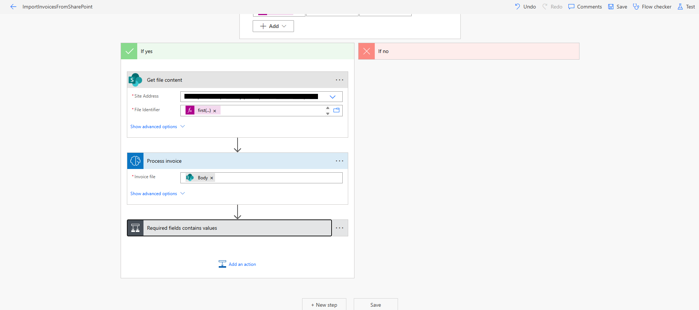
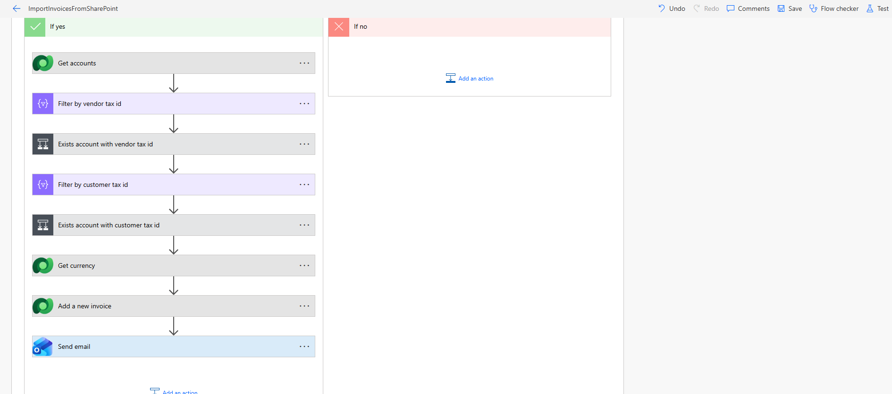
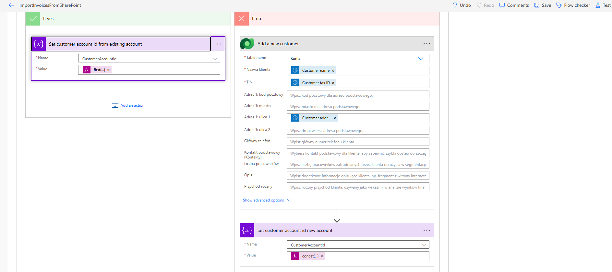
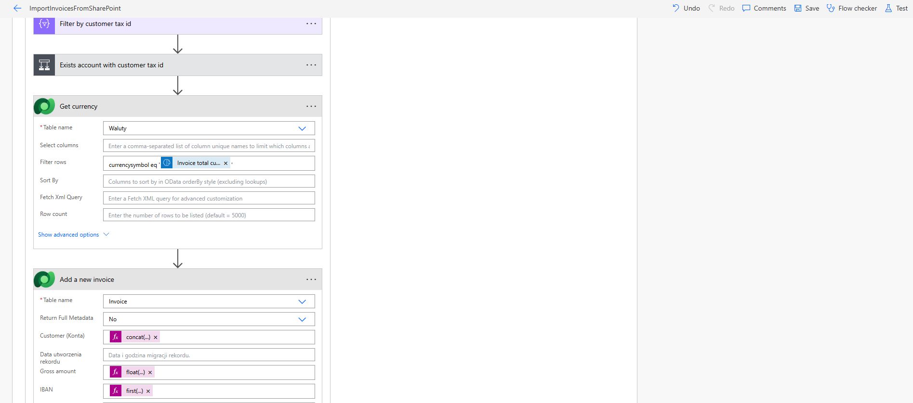
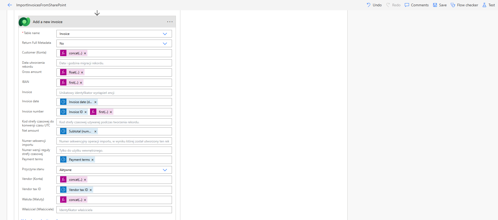
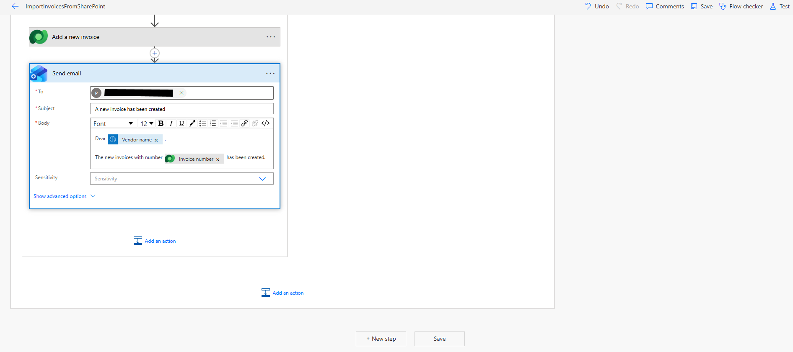
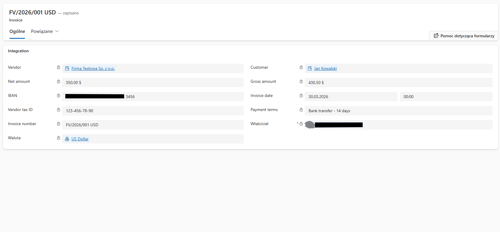
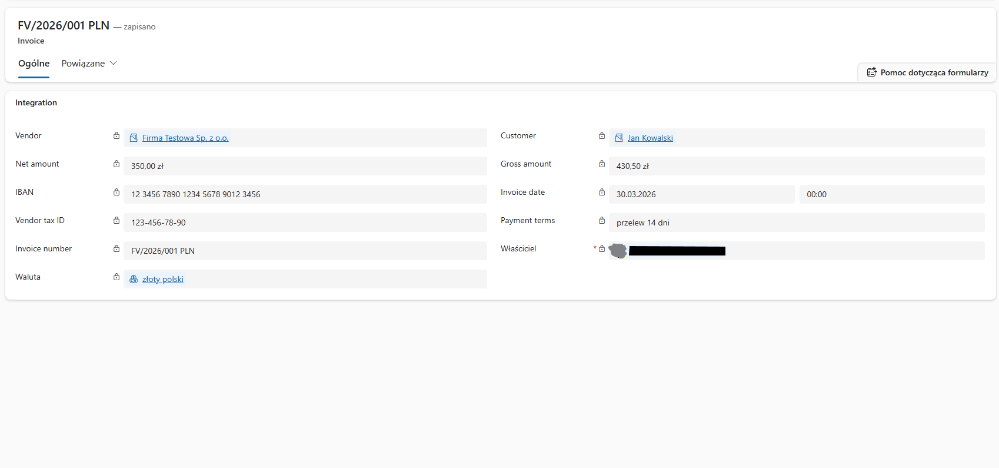

🧩 Projekt: Invoice Processing Automation (Power Platform)

The goal of this project is to automatically create invoices in CRM when attachments are added to SharePoint. The process logic should include:

Creating a new account for the seller and the customer if they do not already exist in the system.
Creating an invoice based on the attachment, using the selected currency.
If the seller and customer records already exist, new records should not be created.

Description:

Automation of invoice processing using:

- Power Automate
- Power Apps
- Microsoft Dataverse
- AI Builder

⚙️ What the system does

1. Retrieves an invoice from SharePoint
2. Extracts data using AI Builder
3. Validates data (Expressions)
4. Saves data to Dataverse
5. Sends notifications (Email)
6. Enables editing in Power Apps

🏗️ Architektura

Power Automate → AI Builder → Dataverse → Power Apps

📸 Screenshots

⚙️ Flow (Power Automate)

➕ Add a new seller when not exists

➕ Add a new customer when not exists

➕ Fetch currency by invoice symbol

➕ Add a new invoice

✉️ Send email

🏢 CRM Dynamic

💡 Challenges

- mapping nested JSON from AI Builder
- inserting a new contact into the standard customer field. I had to add a custom expression.

🔮 Possible extensions

- Azure Functions (C# fallback)
- CI/CD (ALM)
- ERP integration

🏁 Overview:

This project focused on automating invoice processing using the Power Platform ecosystem, including Power Automate, Power Apps, Microsoft Dataverse, and AI Builder. The goal was to streamline data extraction, validation, and management while reducing manual effort.
