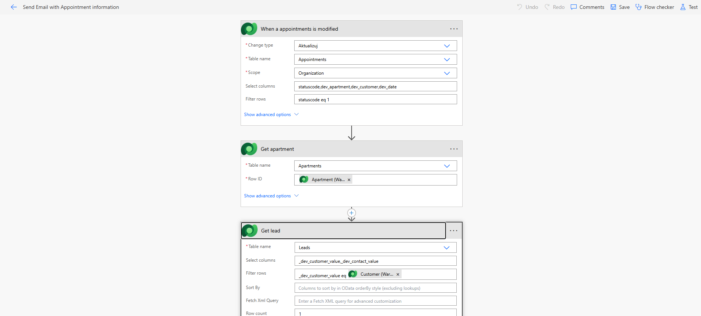
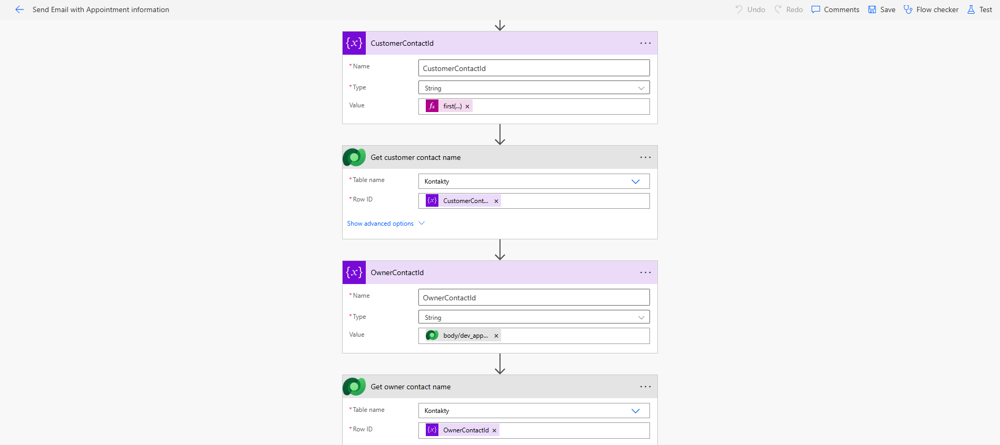
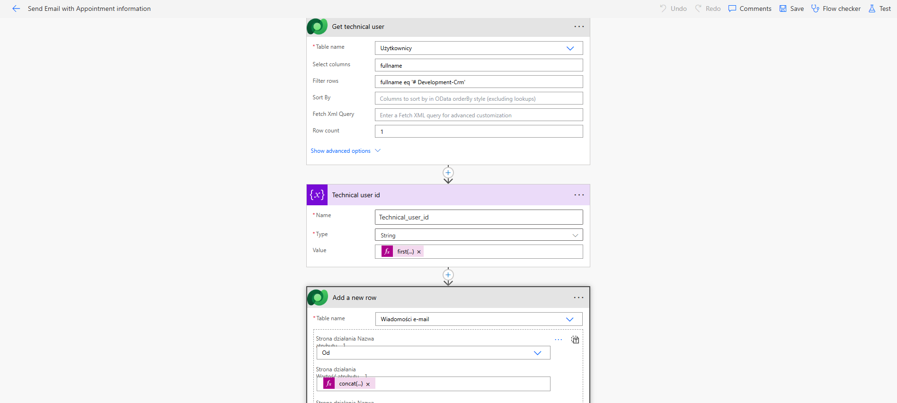
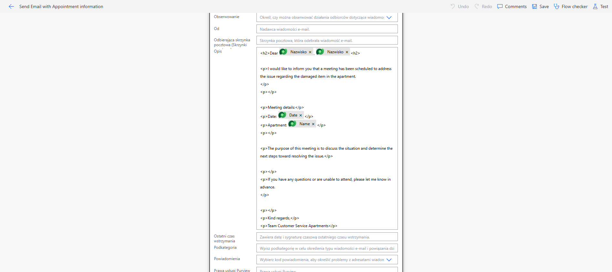
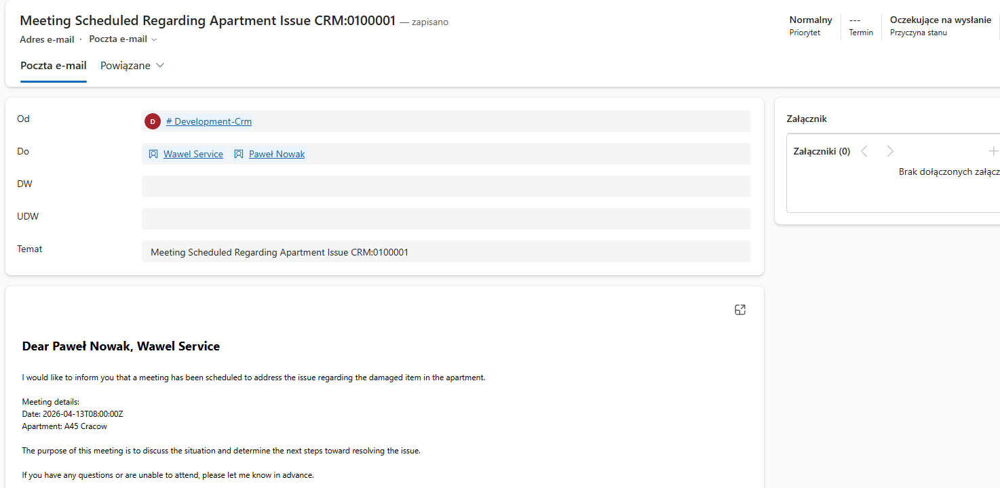

## 🔄 Power Automate Flow – Appointment Notification

This flow automatically sends email notifications when a new appointment is created in the system.

Once an appointment is registered, the flow retrieves details such as the customer, apartment, owner, and scheduled date. It then sends confirmation emails to both the customer and the property owner.

The purpose of this automation is to ensure that all parties are informed about scheduled property viewings in real time, improving communication and reducing manual follow-ups.

