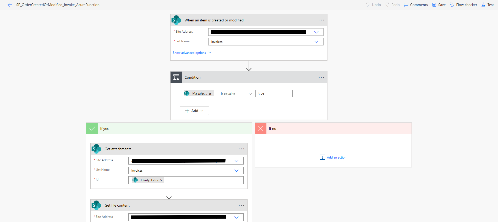
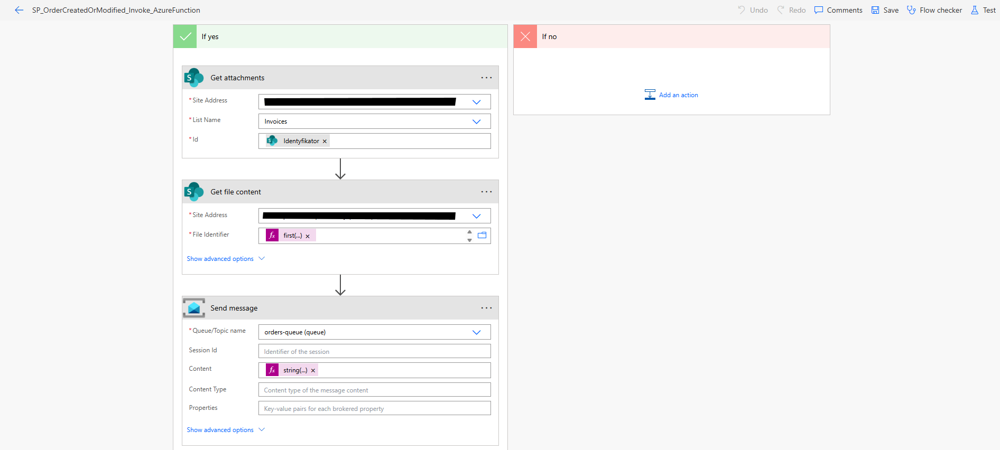

Power Automate Flow – Invoice Processing

This Power Automate flow is triggered when an invoice item is created or modified. It checks whether the invoice contains an attachment, retrieves the file, and sends it to the orders-queue. The message is then processed by Azure Functions to create a corresponding order.

