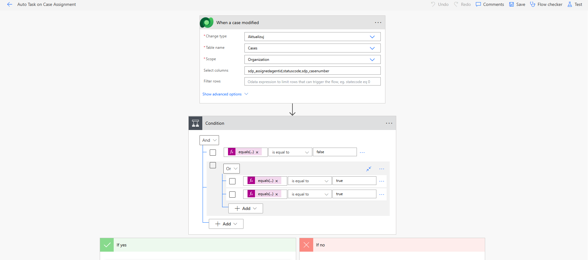
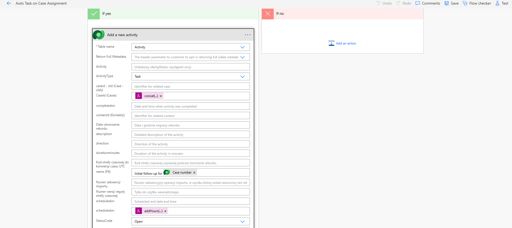

The flow “Auto Task on Case Assignment” is triggered whenever a case record is modified, specifically when the assigned agent field is updated. By limiting the trigger to changes in sdp_assigned_agent_id, the system avoids unnecessary executions and focuses only on assignment events.

A condition is then applied to check that:

the case has an assigned agent (not empty), and
the case status is either New or Assigned

This ensures the automation only runs during the early stages of case handling.

When these conditions are met, the flow automatically creates a new Activity (Task) record in Dataverse. This task serves as an initial follow-up reminder for the assigned agent. Key details are populated dynamically:

The subject references the case number for easy identification
The task is linked directly to the case
The status is set to Open
A due date is automatically scheduled 2 hours from the current time
