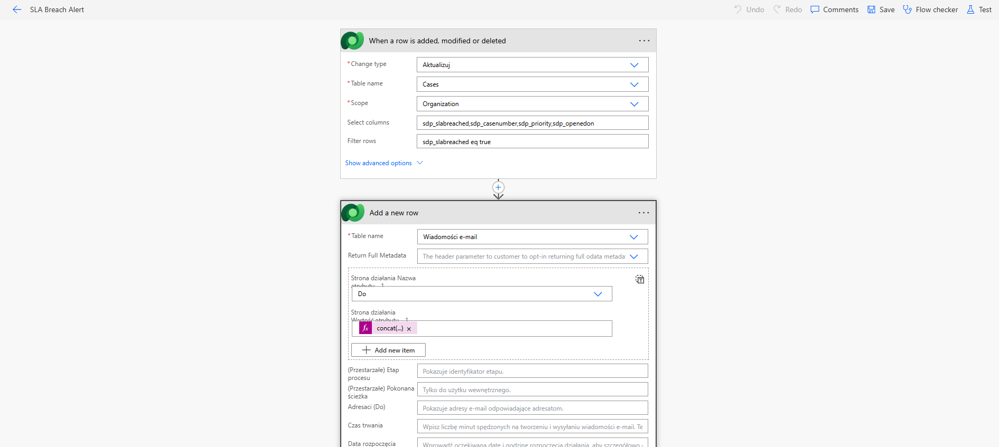

The flow, named “SLA Breach Notification,” is triggered whenever a case record is modified. It is specifically configured to run only when the sdp_sla_breached field changes, which makes the process efficient and avoids unnecessary executions.

A condition is applied to check whether sla_breached = true, ensuring the flow only reacts when an actual SLA violation occurs and not on unrelated updates.

When the condition is met, the flow performs two key actions:

Send an email notification using Microsoft Outlook
The email is sent to the assigned agent and includes important case details such as:
Case number
Title
Priority
Opened date
This ensures the responsible agent is immediately aware of the breach.
Post a message in a team channel using Microsoft Teams
The same case details are shared in a designated team channel, providing visibility to the wider team and enabling quicker response or escalation.
