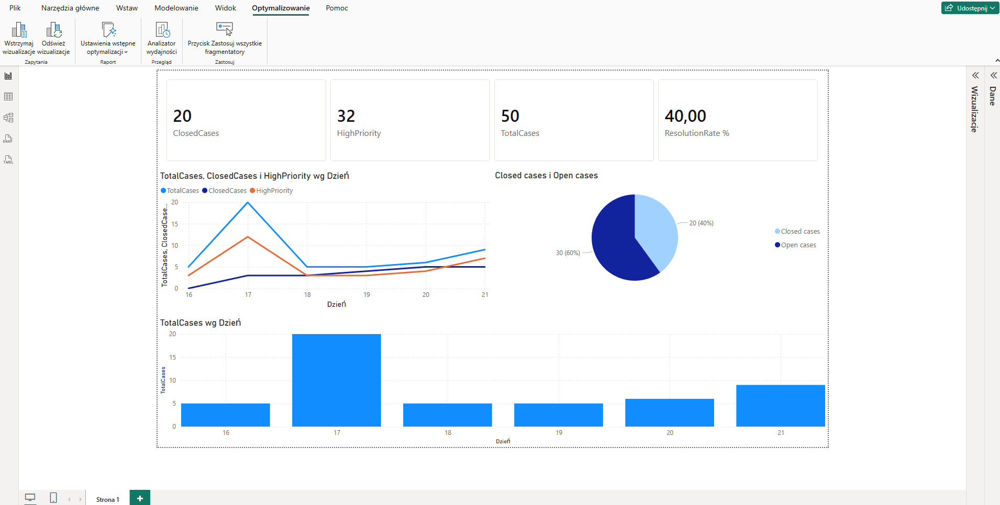

📊 CRM Report — Automated Dashboard

A system that automatically collects data from a CRM, counts key metrics, and displays them in a live Power BI dashboard — every hour, without any manual work.

🤔 What does this project do?
Imagine you manage a customer support team. Every hour you want to know:

How many open cases do we have right now?
How many are high priority?
How many have been resolved?

This project does that automatically. No spreadsheets. No manual counting. No copy-pasting.
Every hour, automatically:

CRM system → Database → Dashboard
(customer cases) (stores data) (Power BI)

"fetch latest data" "save for history" "show on screen"

✨ What you get
FeatureDescription⏰ Runs every hourFully automatic — no one needs to press anything📥 Pulls live CRM dataConnects directly to your customer case system🗄️ Saves historyEvery run is stored — you can see trends over weeks and months📊 Power BI dashboardVisual charts that update automatically🔢 Key metricsTotal cases, high priority cases, closed cases, resolution rate

📊 Dashboard preview
The Power BI report shows 4 key numbers at the top:
┌─────────────┐ ┌─────────────┐ ┌─────────────┐ ┌─────────────┐
│ Total cases │ │High priority│ │Closed cases │ │ Resolution │
│ 24 │ │ 6 │ │ 18 │ │ 75% │
└─────────────┘ └─────────────┘ └─────────────┘ └─────────────┘

         📈 Trend chart — how all metrics change over time
         🍩 Donut chart — open vs resolved cases

🛠️ Built with
ToolWhat it does in this projectAzure FunctionsThe engine — runs the code every hour automaticallyMicrosoft DataverseWhere the CRM data lives (customer cases)Azure SQLStores all the collected data and historyPower BITurns the data into visual charts and dashboards

No servers to manage. No buttons to press. It just runs.

🗂️ What's inside this repo
📁 azure-functions/
📁 reporting/
📄 ReportFunction.cs ← the main code that runs every hour

📄 README.md ← you are here

🚀 How it works — step by step
Step 1 — Timer fires (every hour, automatically)
Step 2 — Connect to CRM
The system logs into your CRM using a secure app account and fetches all current cases.
Step 3 — Count the numbers
It counts total cases, high priority cases, and closed cases.
Step 4 — Save to database
Results are saved with a timestamp. This builds up a history over time.
Step 5 — Power BI reads the data
Power BI refreshes every hour and shows the latest numbers on the dashboard.

💡 Why is this useful?
Without this project:

Someone manually exports data from CRM every day
Pastes it into Excel
Updates charts by hand
Sends a report email

With this project:

Everything happens automatically
The dashboard is always up to date
You can see trends going back weeks or months
No human effort needed after setup

🔮 What could be added next

📧 Email report — send a summary email every morning automatically
🚨 Alerts — get notified when high priority cases go above a limit
🔒 Passwordless login — more secure way to connect to the database
🧪 Tests — automated checks to make sure everything keeps working

👤 About this project
Built as a learning project to practice:

Cloud automation with Azure Functions
Connecting to Microsoft Dataverse / CRM
Building real-time dashboards with Power BI
Working with Azure SQL databases
